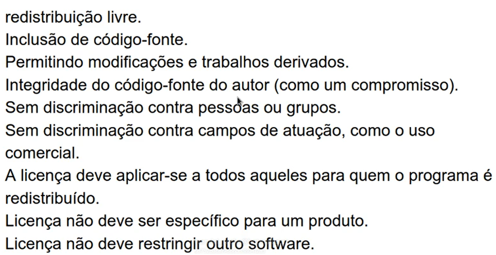

# LinuxAdmin-LINUXtips
Repositório para anotações e arquivos do treinamento Linux Admin da Linuxtips.

## Dia 0 

- Termos e condições
- Suporte ao estudante 
- Telegram

## Day 1

**Requisitos:**

- Curiosidade e vontade de aprender Linux;
- Computador com sistema Windows, Linux ou MacOS já instalado;
- Ensinaremos a criar uma máquina virtual passo a passo, assim, poderá testar sem medo tudo que aprender aqui, sem risco de danificar algo no seu sistema Windows/Linux/MacOS existente;
- 40Gb de espaço em disco livre para instalação do VirtualBox e máquina virtual;
- Máquina com no mínimo 2 Gb de RAM;
- Conexão com a internet de pelo menos 512Kb/s;
- Acessar o Guia Foca online em https://www.guiafoca.org/guiaonline/

**Linux**

Kernel - Faz a interação entre o hardware e as aplicações, como o sistema operacional, por exemplo; Foi desenvolvido por Linus Torvalds em 1991.

**Distribuições Linux**

Originais: 

- Debian, lançada em 1993 e derivou distribuições como Ubuntu, Kali-Linux, Linux Mint entre outras; 

- RedHat, lancçada em 1991 e derivou distribuições como CentOS, Fedora, RockyLinux entre outras;

- Outras distrinuições são póprias como Slackware, SUSE, Arch Linux entre outras;

- Essas derivações buscam entregar algo de novo e/ou diferente nas distribuições, como por exemplos pacotes que a distribuição de origem não permite que sejam distribuídos, como no caso do Kali-Linux;  

**Licenças**

- GPLv2
- GPLv3
- BSD
- Apache 
- MIT
- Creative Commons

O Kernel Linux ficou na licença GPLv2, pois Linus não concordou com algumas mudaças da v3; As GPLs, são mais restritivas no intuito proteger alguns conceitos de software livre: não vender, sempre distribuir código fonte etc. 

**GNU e Software Livre**

- GNU é um sistema operacional gratuito e semelhante ao Unix. 
- É composto por programas, bibliotecas, ferramentas de desenvolvimento e jogos;
- O GNU é um acrônimo recursivo que significa "GNU's Not Unix". 
- O Projeto GNU foi criado em 1983 por Richard Stallman; desde 
- O objetivo do projeto era resgatar o espírito cooperativo da comunidade de computação; 
- O GNU pode ser usado como um sistema operacional ou em partes com outros sistemas operacionais; 
- O GNU/Linux é um sistema operacional completo que combina o kernel Linux com os componentes do GNU.
- No OpenSource (Software Livre) garante 4 grandes liberdades (não tem a ver com o preço): executar o software, distribuir o software, estudar o software, melhorar e distribuir para comunidade;

Sem o GNU o Linux não iria funcionar com toda sua capacidade, então as comunidades não devem se desassociar.

**DFSG -  Debian Free Software Guideline**

Regras que devem ser seguidas para guiar a distribuição de software construído com o Debian.



**BSD**

"Berkeley Software Distribution" é um sistema operacional UNIX com desenvolvimento derivado e distribuido pelo Computer Research Group da Universidade da Califórnia em Berkeley, de 1977 a 1995.

Também compõe o ecosistema Linux, então podemos considerar sistemas Linux tudo que envolve o kernel mais GNU/BSD/Apache/MIT, Android etc.

Por isso é importante entender que o Linux está aí em todas as partes, desde celulares Android até em softwares utilizados por astronautas. 

**Ambiente para o Curso**

No curso foi apresentado como utilizar máquinas virtuais no VirtualBox, tanto na versão Windows quanto na versão Linux. 

Instalação do VirtuaBox no Linux - Comandos

Para instalar o Virtualbox no Debian / Ubuntu

Add a chave que garante confiança em downloads da Oracle


```bash
wget -q https://www.virtualbox.org/download/oracle_vbox_2016.asc -O- | sudo apt-key add -
```


```bash
wget -q https://www.virtualbox.org/download/oracle_vbox.asc -O- | sudo apt-key add -
```

Add o repositório de atualização dos pacotes 

- Se for Ubuntu, substituir 'buster' pela release do Ubuntu (trusty) 

```bash
echo "deb [arch=amd64] https://download.virtualbox.org/virtualbox/debian buster contrib" > /etc/apt/sources.list.d/virtualbox.list
```

Atualiza a lista de pacotes

```bash
apt-get update
```

Instala pacotes adicionais que vão garantir que o VirtualBox funcionará corretamente

```bash
apt-get install make gcc libncurses5-dev linux-headers-$(uname -r)
```

Instala o Virtual Box versão 6.1

```bash
apt-get install virtualbox-6.1
```
Eu optei por criar essa infraestrutura na nuvem da Oracle, utilizando IaC e para tanto utilizei o Terraform (código neste repositório).

**Instalação do Debian Linux**

Foi instalada uma máquina virtual com Debian 10 com 768GB RAM e 8GB no modo texto. Importante observar que atualmente com os SSDs e com a grande quantidade de RAM disponível não , a Swap não tem mais tanta importância; também não há forte recomendação de configurar o SWAP em SSDs, devido ao alto número de leitura e escrita, o que pode ocasionar a diminuição do tempo de vida útil do SSD. 

Instalação dos pacotes iniciais (como root). 

apt install tree coreutils bsdutils bsdmainutils net-tools man-db

**Conclusão do Dia 01**

Agradecimentos e conclusão para o Dia 02 que será  ministrado pelo Jeferson.

## Day 2

**Primeiro Acesso ao Linux via SSH**

*Comandos utilizados*

Commando SSH (Secure Shell)

Executa uma conexão a um determinado shell remoto de maneira segura. 

ssh usuario@ip_ou_nome_da_maquina = o @ significa at, ou seja, usuário x no IP ou Nome. 

Exemplo:

    ssh ubuntu@150.136.246.116 (usuário ubuntu no IP 150.136.246.116)

*Outros comandos*

    cat /etc/os-release 
    su -
    sudo su
    cat /etc/debian_version
    cat /etc/os-release

**Conhecendo o Shell do Linux**

O Shell é o ambiente que realiza a interação entre o usuário e o kernel.

*Comandos executados*

    cat /etc/shells

**O que é um arquivo e um diretório**

**Estrutura de diretórios do Linux e FHS**

LSB - Linux Standard Base 

FHS - Filesystem Hierarchy Standard

    /bin - binários (executáveis) usuários por todos
    /boot - arquivos relacionados ao boot do sistema
    /grub - pasta do GRand Unified Bootloader do sistema
        
    

    

